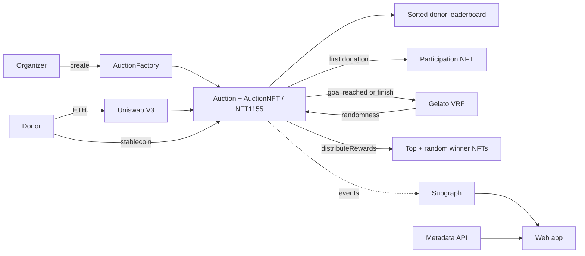

<p align="center">
  <a href="https://redduck.io">
    <picture>
      <source media="(prefers-color-scheme: dark)" srcset=".github/assets/redduck-logo-dark.svg">
      
    </picture>
  </a>
</p>

<h1 align="center">KYD</h1>

<p align="center">
  <b>Know Your Donation — on-chain charity auctions where every donor gets an NFT and the biggest ones get the rare ones.</b>
</p>

---

KYD turns a fundraiser into an auction. Anyone launches one from the factory with a goal, a set of accepted stablecoins and a tier of NFT rewards; donors send stables or plain ETH — the contract swaps it through Uniswap V3 on the way in. First donation already earns a participation NFT, and every donation moves the donor along a sorted on-chain leaderboard whose ordering the contract itself enforces. Once the goal is hit, the top donors mint the top-tier NFTs and a handful of extra winners are drawn with Gelato VRF randomness. Metadata is pinned off-chain and the whole history is indexed by a subgraph the frontend reads from.

## Built with

| Area | Technology |
| --- | --- |
| Monorepo | [Turborepo](https://turborepo.com/) + Yarn workspaces (Node 18+) |
| Contracts | Solidity 0.8.23, [Hardhat](https://hardhat.org/) + Ignition, [OpenZeppelin](https://www.openzeppelin.com/contracts) upgradeable |
| Randomness | [Gelato VRF](https://docs.gelato.cloud/Web3-Services/VRF/Introduction) |
| Swaps | Uniswap V3 router (ETH → stablecoin on donate) |
| Indexing | [The Graph](https://thegraph.com/) subgraph (AssemblyScript) |
| Frontend | React 18 + TypeScript, [Vite](https://vite.dev/), [wagmi](https://wagmi.sh/) + [viem](https://viem.sh/), Web3Modal, Apollo Client, Tailwind + Radix UI |
| Backend | [NestJS](https://nestjs.com/) metadata API, TypeORM + PostgreSQL, [Akord](https://akord.com/) for permanent storage |
| Quality | ESLint, Prettier, solhint, solidity-coverage, [Slither](https://github.com/crytic/slither) |
| Chains | Sepolia, Scroll Sepolia, Polygon |

## How it works



1. **Create.** `AuctionFactory.create` clones an `Auction` plus its NFT collections and wires in the goal, accepted stables, top-winner NFT ids and how many random winners to draw.
2. **Donate.** `donate` takes a supported stablecoin directly; `donateEth` routes ETH through Uniswap V3 into the auction's swap stable first. A first-time donor is minted the participation NFT on the spot. Running totals live in a sorted doubly linked list: the caller passes the insert position and the contract rejects it unless the ordering invariant holds, so the ranking is verified on-chain without an on-chain sort.
3. **Finish.** The auction closes either when `totalDonated` reaches the goal or when the owner calls `finish`. Both paths ask the factory for Gelato VRF randomness.
4. **Distribute.** `distributeRewards` mints the top-tier NFTs down the leaderboard from the largest donor, then draws the random winners from whoever is left.

## Repository layout

| Path | What lives there |
| --- | --- |
| [apps/contracts](apps/contracts) | `Auction`, `AuctionFactory`, `AuctionNFT`, `AuctionNFT1155`, libraries (linked list, decimals, Uniswap actions), Hardhat tests and Ignition modules |
| [apps/contracts/subgraph](apps/contracts/subgraph) | The Graph manifests, schema and event handlers per network |
| [apps/web](apps/web) | The dApp: browse auctions, create one, donate, view NFTs and profile |
| [apps/backend/metadata-api](apps/backend/metadata-api) | NestJS service serving auction and NFT metadata, backed by PostgreSQL and Akord storage |
| [packages/](packages) | Shared ESLint, Prettier and TypeScript configs |

## Getting started

Prerequisites: Node.js 18+ and Yarn 1.22.

```bash
yarn install       # install every workspace
yarn dev           # run all apps through Turborepo
yarn dev:web       # or just the frontend
yarn build:all     # build everything
```

Contract work happens inside [apps/contracts](apps/contracts) — create a `.env` from `.env.example`, then:

```bash
yarn compile   # hardhat compile
yarn test      # hardhat test
yarn coverage  # solidity-coverage report
yarn slither   # static analysis
yarn deploy ./ignition/modules/<module>.ts -- --parameters ./ignition/parameters.json --network <network>
```

## Deployments

### Scroll Sepolia

| Contract | Address |
| --- | --- |
| Auction implementation | [`0xDb9e29625bA0c82356881a72a22125B5072F6E04`](https://sepolia.scrollscan.dev/address/0xDb9e29625bA0c82356881a72a22125B5072F6E04) |
| Auction NFT implementation | [`0xBeC391dE16A9068Ba08602c5ad5EE7a45BcFF380`](https://sepolia.scrollscan.dev/address/0xBeC391dE16A9068Ba08602c5ad5EE7a45BcFF380) |
| Auction NFT1155 implementation | [`0xddCFd512Eaa4318d76354873319f4BB7ae1e1E65`](https://sepolia.scrollscan.dev/address/0xddCFd512Eaa4318d76354873319f4BB7ae1e1E65) |
| Auction Factory | [`0xdbCAccB6F2319f5Dba667f088bB67E71C62A5155`](https://sepolia.scrollscan.dev/address/0xdbCAccB6F2319f5Dba667f088bB67E71C62A5155) |

### Subgraphs

| Network | Endpoint |
| --- | --- |
| Sepolia | `https://api.studio.thegraph.com/query/9868/kyd-sep/v0.0.5` |
| Scroll Sepolia | `https://api.studio.thegraph.com/query/49166/kyd-scroll-sepolia/v0.0.1` |
| Polygon | `https://api.studio.thegraph.com/query/49166/kyd-polygon/v1.0.0` |

## License

[MIT](LICENSE)
